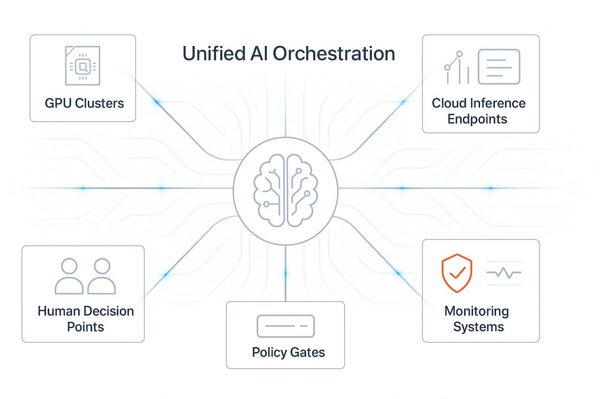

Ten years ago, data teams were drowning in cron jobs. Every data pipeline was a snowflake, every failure was a mystery, and scaling meant copying and pasting shell scripts until something broke. Then orchestration platforms like Airflow came along and gave us something revolutionary: a way to think about data workflows as first-class citizens with dependencies, retries, and observability baked in.

We solved the plumbing problem for data. But AI systems? We're back to the cron job era.

When I mapped out the AI infrastructure stack recently, I identified orchestration as one of seven critical layers. But for AI systems, orchestration isn't just another layer; it's the nervous system that coordinates everything else.

I see teams running model training on Kubernetes, inference on serverless functions, evaluation scripts as GitHub Actions, and monitoring through a patchwork of dashboards and Slack alerts. Each piece works in isolation, but there's no connective tissue between them. No shared understanding of what constitutes a "healthy" AI system or how all these moving parts should coordinate when something goes wrong.

This is why I've become convinced that AI needs a new approach to orchestration—one that extends the proven patterns we've built for data while embracing the unique challenges of AI systems. I call this "unified orchestration," and while it builds on the foundations we've established with tools like Airflow, it requires us to think beyond the batch-first, schedule-centric patterns that defined the first generation of workflow orchestration.

## The Principles of Unified AI Orchestration

After watching dozens of teams struggle to operationalize AI systems, I've identified six core principles that any unified orchestration platform needs to embrace:

**Event-driven architecture.**  Traditional data orchestration runs on schedules, like ETL jobs that kick off at 3 AM or reports that generate every Monday morning. AI systems live in a different world. A model needs retraining when drift is detected, not when the calendar says so. An inference endpoint needs scaling when traffic spikes, not on a predetermined schedule. Unified orchestration must be reactive, not just scheduled.

**Asset-centric thinking.** In data orchestration, we think about tasks and dependencies. In AI orchestration, we need to think about assets like models, datasets, evaluation results, deployment configs, and how they evolve over time. A model isn't just a file; it's a living entity with versions, performance metrics, lineage, and business impact. The orchestration layer needs to understand these assets and their relationships.

**Evaluation-first workflows.** Here's where AI differs most sharply from traditional data workflows. In data, success is often binary: the job ran or it didn't. In AI, success is probabilistic and contextual. Did the model perform better than the previous version? Are the outputs aligned with business goals? Is it behaving fairly across different user segments? Unified orchestration must treat evaluation as a first-class concern, not an afterthought.

**Human-in-the-loop by design.**  No data pipeline needs a human to approve whether Tuesday's sales numbers look reasonable before they flow to the next step. But AI systems regularly produce outputs that require human judgment. Should we deploy this model version? Is this generated content appropriate? How do we handle edge cases the model wasn't trained for? The orchestration layer needs built-in patterns for human decision points, not awkward workarounds.

**Multi-runtime flexibility.** Data workflows typically run in predictable environments such as your Spark cluster, your warehouse or your cloud provider of choice. AI workloads are more chaotic. Training might happen on specialized GPU clusters, inference on edge devices, evaluation in notebooks, and monitoring through SaaS platforms. Unified orchestration can't assume a single runtime; it needs to coordinate across whatever infrastructure AI teams are actually using.

**Policy and guardrails as code.** In data systems, governance often means access controls and data quality checks. In AI, it means safety constraints, fairness requirements, compliance boundaries, and business rules about when models can be deployed or updated. These policies need to be expressed as code and enforced automatically by the orchestration layer, not managed through spreadsheets and Slack channels.

## How This Differs from Traditional DAG Schedulers

If you're familiar with Airflow or other workflow orchestrators, you might be thinking, "Can't I just extend those for AI?" And absolutely! Many of the core concepts translate beautifully. The idea of dependencies, retries, observability, and treating workflows as code remains foundational.

But AI workloads push against some of the assumptions that shaped traditional orchestrators. Where Airflow excels at deterministic, batch-oriented workflows with clear success criteria, AI systems are probabilistic, event-driven, and context-dependent. The challenge isn't that our existing tools are wrong, it's that they were optimized for a different set of problems.

AI systems are probabilistic, event-driven, and success is contextual. The "workflow" isn't just a training pipeline, it's an ongoing conversation between models, evaluation systems, human reviewers, and production environments. Traditional DAG schedulers force you to shoehorn these dynamic interactions into static workflow definitions.

More importantly, traditional orchestrators treat the computational work as the primary concern and everything else as metadata. In AI systems, the metadata—model performance, evaluation results, deployment history, policy compliance—often drives the orchestration decisions. This shifts the paradigm from "execute these tasks in order" to "coordinate these intelligent systems based on their behavior and performance."

## What a Practical V1 Might Look Like

So what would unified orchestration actually look like in practice? I'm not talking about a complete overhaul of your AI infrastructure on day one. I'm thinking about the minimal viable connective tissue that could start bringing order to the chaos.

**Smart triggers** that respond to business events, not just time. Instead of retraining models every week, retrain them when drift detection crosses a threshold, when new ground truth data becomes available, or when evaluation metrics drop below business requirements. These triggers would understand the context of your AI systems, not just fire on generic conditions.

**Asset metadata that travels with your artifacts.** When a model gets deployed, the orchestration system should know its evaluation history, training data lineage, and performance characteristics. When an evaluation fails, it should know which models and datasets are affected and what workflows need to be paused or rolled back. This isn't just logging. It's active metadata that drives orchestration decisions.

**Rollback paths that actually work.** Data pipelines can usually be "fixed forward"—run the corrected job and move on. AI systems need more sophisticated rollback capabilities. If a newly deployed model starts behaving badly, you need to instantly revert to the previous version while preserving all the evaluation data and incident context for later analysis.

This isn't about replacing your existing orchestration infrastructure, it's about extending it with new primitives and patterns that understand the unique requirements of AI systems — whether that's through new operators in Airflow, specialized orchestration layers that integrate with your existing tools, or hybrid approaches that let you evolve your current setup rather than starting over.

## The Foundation for Trust and Scalability

I keep coming back to why orchestration mattered so much for data systems. While yes, it was partly about convenience and reducing boilerplate code, the real reason is that it created trust. When you can see the dependencies between your data workflows, when failures are automatically handled with retries and alerts, when you have lineage and observability built in, that's when teams start trusting their data enough to build business-critical applications on top of it.

AI systems need that same foundation of trust, but the stakes are even higher. AI models make decisions that affect customers, employees, and business outcomes in ways that traditional data processing rarely does. Without unified orchestration, AI systems remain fragile collections of scripts and services that work until they don't.

The teams that figure out unified orchestration first will have a massive advantage. They'll be able to deploy AI systems with confidence, iterate rapidly without breaking production, and scale their AI capabilities without drowning in operational complexity.

Making engineers' lives easier is a welcome side effect, but this is really about unlocking the next phase of AI adoption, where AI systems are reliable enough to power core business processes and responsive enough to adapt as business needs evolve.

Orchestration solved the plumbing problem for data. Now it's time to solve it for AI. But technical architecture is only half the challenge: the other half is building the governance frameworks that turn promising AI infrastructure into trustworthy, sustainable platforms.
